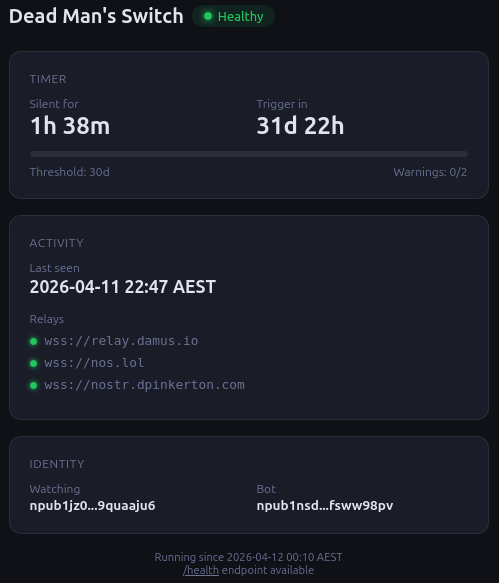

A dead man's switch triggers actions if you stop responding. The existing ones — [Aeterna](https://github.com/alpyxn/aeterna), [LastSignal](https://github.com/giovantenne/lastsignal) — require periodic manual check-ins. That works. But Nostr already has a better signal: every post, reaction, zap, and repost is a cryptographically signed event tied to your public key. Your normal usage is proof of life.

I built [nostr-dead-man-switch](https://github.com/AusDavo/nostr-dead-man-switch) to use that signal. It subscribes to relays, watches for any event from my npub, and resets its timer on activity. If I go quiet for long enough and don't respond to warning DMs, it fires off emails, webhooks, or Nostr notes to the people who need to know.

## How It Works

The switch monitors your npub across multiple relays. Any signed event — a post, a like, a zap, a repost — resets the timer. If the timer exceeds your silence threshold (I use 30 days), it sends you an encrypted DM as a last-resort check-in. If you don't respond and another interval passes, it sends a second warning. Still nothing? It triggers.

```
Monitor npub across relays
         │
    Any event? ──yes──→ Reset timer
         │
         no (silence threshold exceeded)
         │
    Send warning DM
         │
    Wait... any event? ──yes──→ Reset timer
         │
         no (after configured warnings)
         │
    ┌─────────────┐
    │   TRIGGER    │
    │              │
    │  • emails    │
    │  • webhooks  │
    │  • notes     │
    └─────────────┘
```

The warning DMs are NIP-04 encrypted and sent from a dedicated bot keypair. The bot never needs your private key — it only needs its own nsec (to send DMs and sign notes) and your npub (to watch and message).

When it triggers, you configure what happens. I have email actions set up, but it supports webhooks (ntfy, Telegram, Discord, Slack, generic HTTP), Nostr notes signed by the bot, and pre-signed Nostr events published from your own identity.

That last one is worth highlighting: you sign an event with your own nsec ahead of time, paste the JSON into the config, and the bot publishes it when triggered. It appears as your post. The bot never sees your key.

## The Stack

It's a single Go binary. About 7 MB in the Docker image.

```
┌──────────────┐       ┌──────────────────┐
│  Go binary   │──ws──▶│  Nostr relays     │
│              │       └──────────────────┘
│  - monitor   │
│  - timer     │──────▶ state.json
│  - actions   │
│  - dashboard │──http─▶ :8080
└──────────────┘
```

- **Go 1.23** with [go-nostr](https://github.com/nbd-wtf/go-nostr) for relay subscriptions, event signing, and NIP-04 encryption
- **Docker multi-stage build** — Alpine builder, Alpine runtime with `ca-certificates` and `tzdata`
- **YAML config** with `${VAR}` expansion for secrets from `.env`
- **JSON state file** tracking last seen timestamp, warning count, and triggered flag

The config supports human-friendly durations — `30d`, `4w`, `720h` — parsed with a custom YAML unmarshaler. Secrets (bot nsec, SMTP password, webhook URLs) stay in `.env`. Everything else — relay list, timing, action templates — goes directly in `config.yaml`.

## Status Dashboard

Setting `listen_addr: ":8080"` enables a status page that shows the current state at a glance:



The dashboard shows:
- **Timer** — how long you've been silent and how long until trigger
- **Progress bar** — visual countdown across the full silence + warning window
- **Relay status** — per-relay connection state with live indicators
- **Identity** — truncated npubs for the watched key and the bot

It auto-refreshes every 60 seconds. There's also a `/health` JSON endpoint for monitoring:

```json
{
  "status": "healthy",
  "last_seen": "2026-04-11T12:00:00Z",
  "silence_seconds": 3600,
  "warnings_sent": 0,
  "triggered": false
}
```

I run mine behind Caddy with OAuth2 authentication (via [Pocket ID](https://github.com/pocket-id/pocket-id)), but that's optional. If you're only exposing it on a private network, the bare HTTP server is fine.

## Deployment

The quick start is straightforward:

```bash
git clone https://github.com/AusDavo/nostr-dead-man-switch.git
cd nostr-dead-man-switch

# Generate a dedicated bot keypair
docker compose run --rm deadman --generate-key

# Configure
cp .env.example .env        # Add bot nsec + any action secrets
cp config.example.yaml config.yaml  # Add your npub, relays, timing, actions

# Run
docker compose up -d
```

The `config.example.yaml` has complete, ready-to-uncomment templates for every action type — SMTP email with provider-specific notes (Gmail, Fastmail, Outlook, Proton Bridge), ntfy push notifications, Telegram/Discord/Slack webhooks, bot-signed Nostr notes, and pre-signed events. Each template includes the actual endpoint URLs, required headers, and realistic message bodies. You uncomment what you need and fill in your values.

## What I'd Add

This is v1. It does what I need. A few things I've thought about but haven't built:

- **NIP-17 DMs** — the current warning DMs use NIP-04, which is functional but has known metadata leakage. NIP-17 (gift-wrapped DMs) would be better.
- **Multiple watched pubkeys** — monitoring more than one person from a single instance.
- **Snooze via DM reply** — replying to the warning DM with a keyword to extend the timer without posting publicly.
- **Adding Simplex** — extending actions to include sending Simplex messages for enhanced security and privacy.

The repo is at [github.com/AusDavo/nostr-dead-man-switch](https://github.com/AusDavo/nostr-dead-man-switch). MIT licensed.
